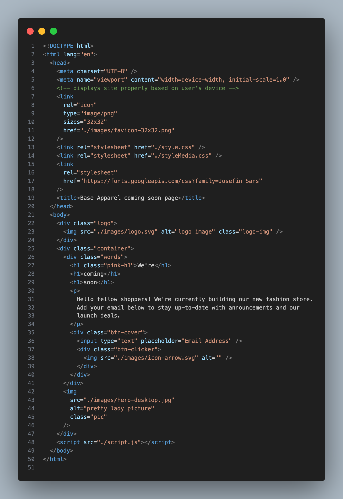
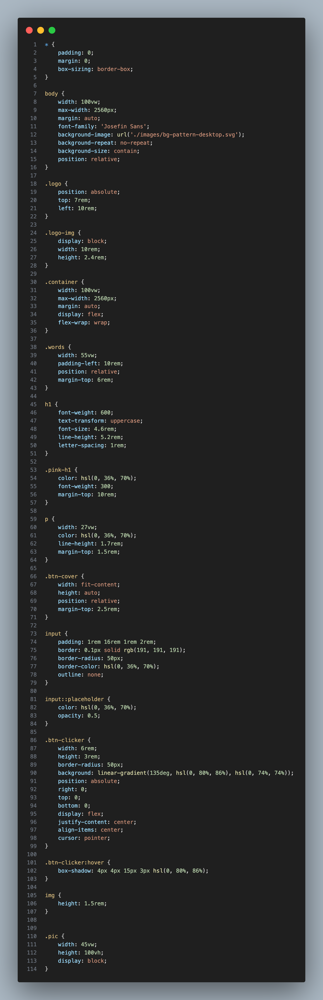
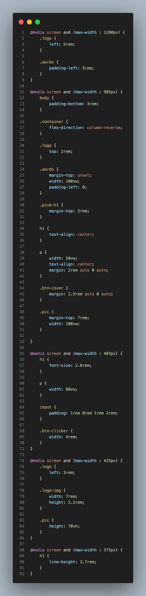
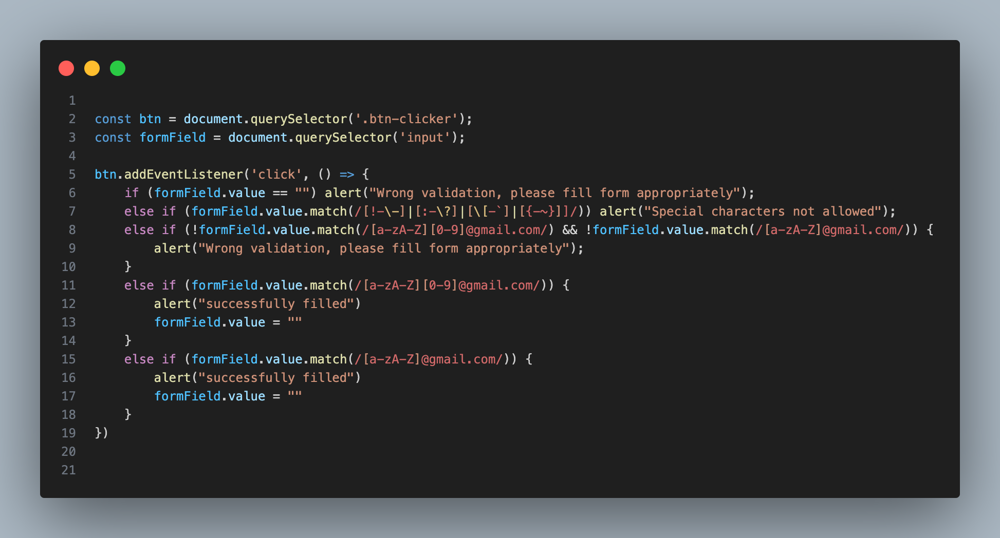

# Base Apparel coming soon page

This is a solution to the [Base Apparel coming soon page challenge on Frontend Mentor](https://www.frontendmentor.io/challenges/base-apparel-coming-soon-page-5d46b47f8db8a7063f9331a0). 

## The challenge
Your users should be able to:

- View the optimal layout for the interface depending on their device's screen size
- See hover and focus states for all interactive elements on the page

## Screenshots

## Code Screenshots

  

## Deployed using github

The application is hosted on github, check it out here [Base-Apparel-coming-soon-page](https://dvelatcodes.github.io/coming-soon-page/)

### Built with

- Semantic HTML5 markup
- CSS custom properties
- Flexbox
- Media Queries
- Javascript

## Author

- Website - [My portfolio](https://dvelat-portfolio.vercel.app/)
- Frontend Mentor - [@dvelatcodes](https://www.frontendmentor.io/profile/dvelatcodes)
- Linkedin - [@Love (Dvelat codes) Olubummo](https://www.linkedin.com/in/love-olubummo-dvelat/)
